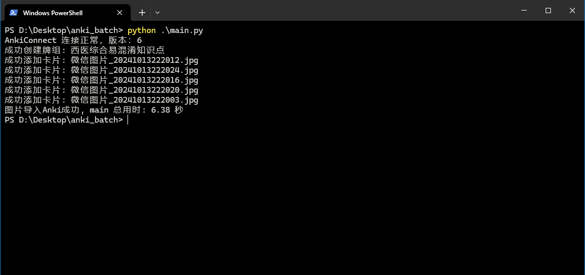

# Anki_Batch

# 背景

我一个学医的朋友，他收藏了很多医学考研的题目，这些题目都是一张张的截图，他想把这些图片添加到 Anki 里，利用 anki 的特性，帮助他记忆这些题目。
这些截图有上百张，如果一个一个添加到 Anki 里，太费时费力，所以我写了这个脚本，帮他批量添加图片到 Anki，制作成一个牌组。

# 如何使用

## 安装 Python 环境和项目依赖

当前项目的 Python 版本为 3.11，请安装 3.11 及以上版本的 Python 环境。

参考:

- 中文：https://blog.csdn.net/weixin_45905741/article/details/129693134
- English：https://www.tomshardware.com/how-to/install-python-on-windows-10-and-11

使用终端（cmd/powershell）进入项目目录,执行

```
pip install -r requirements.txt
```

## 安装 Anki Connect 插件

我的 Anki 客户端版本：24.06.3 (d678e393)⁩

1. 打开 Anki 客户端，点击上方工具栏
2. 点击【插件】，点击右侧【获取插件】，输入 `2055492159`，点击【确定】
3. 下载成功后会在插件页面显示 AnkiConnect，重启 Anki 客户端即可使用

有任何问题请参考官方文档：https://ankiweb.net/shared/info/2055492159

## 运行脚本

1. 修改 `config.py` 文件，配置 "图片所在路径" 和 "牌组名"
2. 使用终端（cmd/powershell）进入项目目录,执行

```
python main.py
```

出现如下结果代表运行成功


